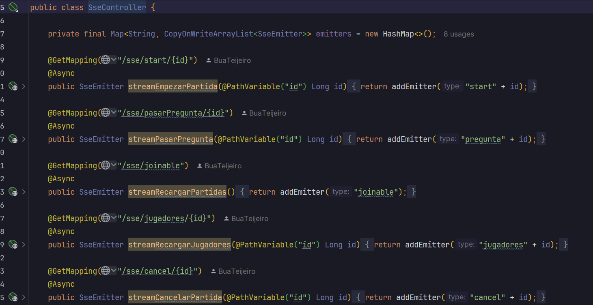
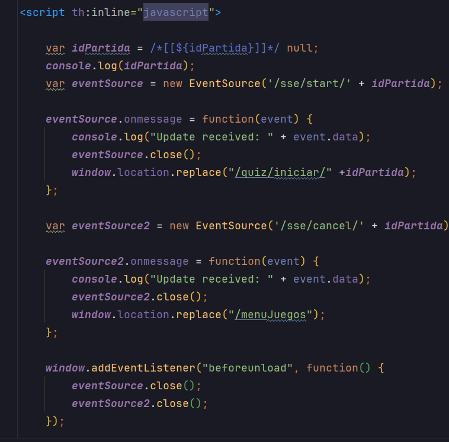
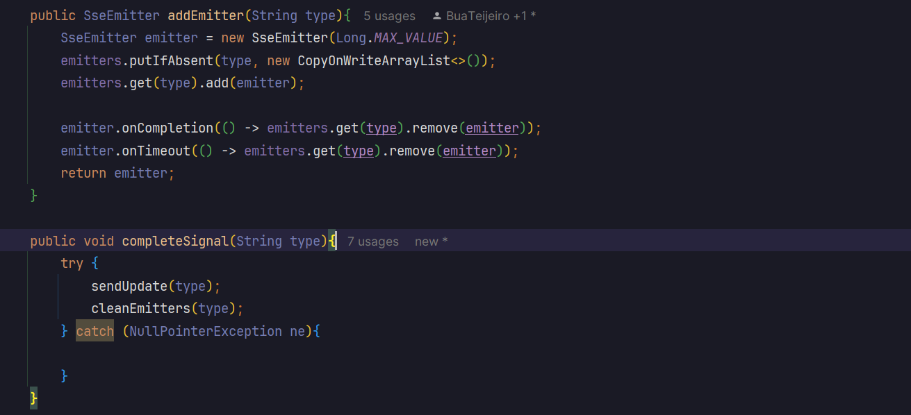
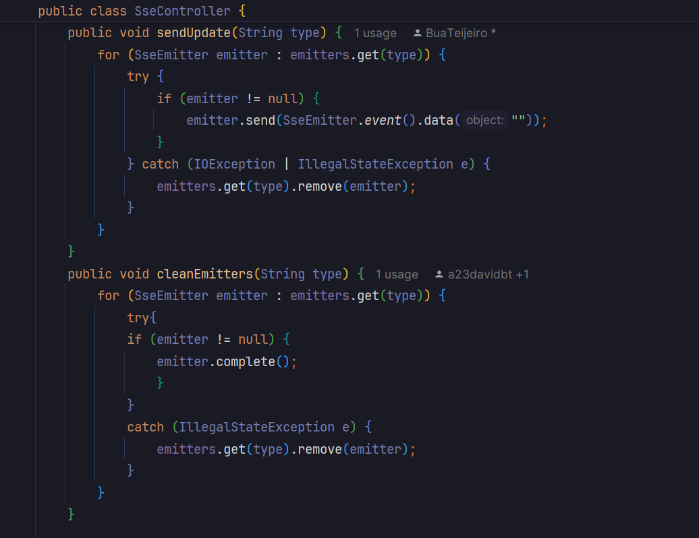
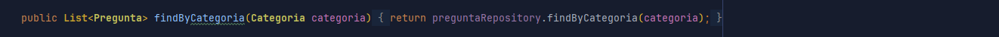
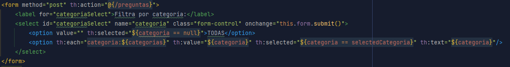
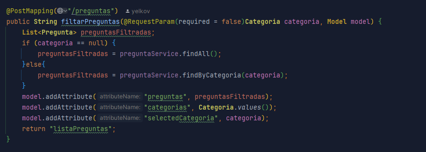
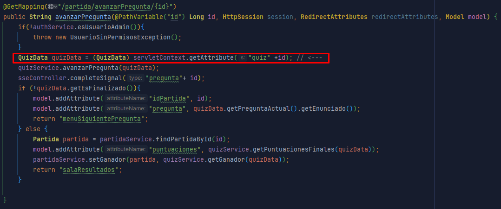

# Quizmasters

Trabajo realizado por Yelko Veiga Quin-tas, Evan Silva González y David Búa Teijeiro como proyecto correspondiente a la unidad 4: Creación de Aplicaciones Web con SpringBoot, de la asignatura de Acceso a Datos de 2ºDAM 24/25.


## Índice
- [Supuesto a resolver](#supuesto-a-resolver-)
  - [Introducción](#introducción)
  - [Usuarios](#usuarios)
  - [Preguntas](#preguntas)
  - [Modos de Juego](#modos-de-juego)
  - [Partidas](#partidas)
  - [Categorías](#categoría)
  - [Modelo de la Base de Datos](#Modelo-de-la-Base-de-Datos)
- [Manual técnico para desarrolladores](#manual-técnico-para-desarrolladores)
  - [Requisitos Previos](#requisitos-previos)
  - [Estructura del proyecto](#estructura)
  - [Código destacado](#código-destacado)
  - [Testing](#testing)
  - [Configuración de Maven](#configuración-de-maven)
  - [Ejecución del proyecto](#ejecución-del-proyecto-)
  - [Despliegue](#despliegue-en-aws-ec2-)
  - [Login](#log-in)
- [Manual de usuario](#manual-de-usuario)
- [Metodología de Desarrollo en Equipo](#metodología-de-desarrollo-en-equipo)
  - [Git](#uso-de-git)
  - [Reparto de tareas](#reparto-de-tareas)
- [Extras Realizados](#extras)
- [Mejoras](#mejoras)
- [Conclusiones](#conclusiones)
- [Autores](#autores)

## Supuesto a resolver 

[Volver al índice](#índice)

### Introducción

___
Deseamos diseñar un juego tipo quiz, dónde varios usuarios se conecten a diferentes partidas, respondiendo a una serie de preguntas, donde la velocidad va marcada por un gameMaster (un usuario de tipo administrador).

___   
#### *Usuarios*

Llevamos un registro de nuestros usuarios con su **correo electrónico** como atributo obligatorio, junto con su **nombre**, **contraseña** y **fecha de nacimiento**. Además, podemos almacenar si el usuario tiene privilegios de administrador mediante el atributo `isAdmin`.

Los usuarios se identifican principalmente por su **correo electrónico** y por su **ID**.  
Hay un registro del número de partidas ganadas por un usuario.
___   
#### *Preguntas*

Llevamos un registro de las **preguntas** de cada partida, cada una con su **enunciado**, **respuesta correcta**, **categoría** y **puntuación** asociada. La **categoría** es un atributo que clasifica la pregunta dentro de un conjunto predefinido. La **puntuación** es un valor de tipo flotante que asigna un valor numérico a cada pregunta.

Cada pregunta tiene un **ID** único, generado automáticamente, y un **enunciado** que debe ser único en la base de datos. Además, debemos asegurarnos que los atributos **respuesta correcta**, **categoría** y **puntuación** no se puedan dejar vacíos.
___   
#### *Modos de Juego*
El **modo de juego** es la plantilla almacenada en el registro a partir de la cual se creará una partida. En el modo de juego se configura la partida a jugar.  
Cada modo cuenta con un **nombre**, **número de preguntas** que se deben responder en el juego y una lista de **categorías** que estarán presentes en ese modo de juego.

Cada **modo de juego** tiene un **ID** único, generado automáticamente.  
Las **categorías** son representadas por un tipo enumerado (`Categoria`). Esta lista se guarda utilizando una relación de colección a través de la anotación `@ElementCollection`, lo que permite almacenar múltiples categorías para cada modo de juego.
___   
#### *Partidas*

El sistema lleva un registro de las **partidas** en curso y terminadas. Cada partida tiene un **ID** único, una **hora y fecha** de inicio, y un estado **joinable** que indica si la partida está abierta para nuevos jugadores.

Una **partida** tiene un **modo de juego** asociado, de modo que varias partidas pueden tener el mismo modo de juego.

Una partida tendrá un número de **preguntas** asociadas, pudiendo aparecer cada una de esas preguntas en diferentes partidas.  
Además, cada partida puede tener múltiples jugadores (**usuarios**).

El sistema permetirá identificar al **ganador** de la partida.
___   
#### *Categoría*

La **Categoría** es un enumerado (`enum`) que define los posibles tipos de categorías en las que pueden clasificarse las preguntas dentro del sistema de juego. Las categorías disponibles son:

- **GEOGRAFÍA**
- **HISTORIA**
- **ARTE Y LITERATURA**
- **DEPORTES Y OCIO**
- **CIENCIA Y NATURALEZA**
- **ENTRETENIMIENTO**

Cada pregunta dentro de la base de datos puede estar asociada a una de estas categorías, lo que permite organizar y  filtrar las preguntas según su temática.
___   
### Modelo de la Base de Datos

A continuación se muestra el esquema Crow's Foot de la base de datos diseñada para implementar el supuesto comentado en el apartado anterior


## Manual técnico para desarrolladores

[Volver al índice](#índice)

### Requisitos previos

- **Java SE 17 o superior**: El proyecto está desarrollado usando Java 17, por lo que necesitarás tener una versión    
  igual o superior    
  instalada. ([descargar](https://www.oracle.com/java/technologies/javase/jdk17-archive-downloads.html))
- **Maven**: La gestión de dependencias se hace con Maven, por lo que deberás tener Maven instalado.([descargar](https://maven.apache.org/download.cgi))
- **IDE recomendado**: Se recomienda el uso de IntelliJ IDEA para un desarrollo más sencillo, pero se puede usar cualquier otro IDE compatible con Java. ([descargar](https://www.jetbrains.com/idea/download/?section=windows))
- **SpringBoot** : Se ha usado SpringBoot para la creación de la aplicación    
  web. ([documentacion](https://spring.io/projects/spring-boot))

### Estructura

[Volver al índice](#índice)

El proyecto está planteado siguiendo el patrón [Modelo-Vista-Controlador.](https://es.wikipedia.org/wiki/Modelo%E2%80%93vista%E2%80%93controlador)

#### Modelo

___ 
El modelo contiene los datos del programa y define cómo estos deben ser manipulados, es decir, contiene la lógica que se necesita para gestionar el estado y las reglas del negocio. Interactúa respondiendo a las solicitudes del controlador para acceder o actualizar los datos. Notifica indirectamente a la vista cuando los datos han cambiado para que se actualice la presentación.

Nuestra aplicación cuenta con los siguientes paquetes:

- **<u>model</u>**: Contiene las clases de acceso a base de datos. En este, se encuentran los    
  siguientes paquetes: `Categoria`, `ModoDeJuego`, `Partida`, `Pregunta`, `Usuario`y `Tarea`, este ultimo como una clase    
  vestigial del proyecto base ofrecido por el tutor.
- **<u>repository</u>**: Interfaces para acceder a la base de datos.
- **<u>service</u>**: Cuenta con varias clases donde se hace uso de los repositorios de la base de datos y se implementa la lógica de negocio.
- **<u>authentication</u>**: cuenta con la clase `ManagerUserSession`para gestionar el login de usuarios.
- **<u>config</u>**: cuenta con una clase `ModelMapperConfig` que permite mapear los DTO a los objetos del modelo.
- **<u>dto</u>**: diferentes clases para manejar el tratamiento de datos desde la vista, como `LoginData`, `PartidaForm` o `QuizData`.

#### Controlador

___ 
El controlador recibe las entradas del usuario desde la vista y las traduce en acciones que el modelo debe ejecutar. Se encarga de interpretar las acciones del usuario, manejar los eventos, y de actualizar tanto el modelo como la vista.

- **<u>java.quizmasters.controller</u>**: Coordina la interacción entre los diferentes componentes. Para cada clase del  modelo de la aplicación existe un controlador que la maneja y estructura los datos del modelo. Además de los controladores que manejan las entidades del modelo, también existe un controlador para gestionar el login, así como otro para gestionar el flujo del Quiz y uno más para manejar la gestión de los administradores en la aplicación.
- **<u>java.quizmasters.restcontroller</u>**: Contiene los controladores de tipo Rest, en este caso solamente el SseController, que gestiona la comunicación entre distintos usuarios mediante la clase SseEmitters,

#### Vista

___
Se encarga de la visualización de los datos del modelo de manera que el usuario los entienda. No contiene lógica de  negocio, solo muestra lo que el modelo le proporciona.. La vista recibe entradas del usuario (clics, teclas, etc.) y las envía al controlador.

- **<u>resources.static.css</u>**: en el directorio css se almacenan los recursos necesarios para definir los estilos de la interfaz.
- **<u>resources.templates</u>**: Es el principal paquete de la vista, con los archivos `*.html`, que es utilizada para almacenar la estructura de las paginas que se visualizan a lo largo de la aplicación. Utilizamos thymeleaf para gestionar la presentación a través de html.

### Código Destacado
[Volver al índice](#índice)

A continuación destacamos los puntos que consideramos más relevantes de nuestro código

#### Sse Controller y SseEmitters
Para que la aplicación cumpla con nuestros propósitos, es necesario que las vistas de unos usuarios cambien de acuerdo a eventos que generan otros (por ejemplo, el adminstrador podrá empezar una partida, y automáticamente todos los jugadores verán en sus pantallas la primera pregunta). Para este tipo de situaciones, Spring Boot cuenta con WebSockets, una herramienta muy potente para la comunicación. No obstante, por tiempo limitado y por ser las comunicaciones que necesitamos más rudimentarias, optamos por implementar un método más sencillo, el uso de SseEmitters gestionado por un SseController. De forma simplificada, se podría considerar que esta clase ayuda a implementar listeners para dar respuesto a los eventos ya mencionados.



La Clase SseController, que es un Bean de tipo RestController, dispondrá de una serie de endpoints, cada uno asociado a un evento en concreto que se quiere escuchar. En la imagen se muestran los que hemos incluído en nuestro caso. Algunos ejemplos son el cambio de las partidas a las que se puede unir el jugador, o la señal de que una partida en concreto ha empezado. Los métodos correspondientes se llaman desde los html que contienen un fragmento de javascript con la definición conexión a uno o varios de estos endpoints. En la siguiente imagen se muestra como ejemplo el código de la sala de espera antes de iniciar una partida, que escucha si la partida que se está esperando empieza o se cancela, redireccionando la vista al endpoint correspondiente en cada caso.



De esta forma, cada vez que se cargue un html que contenga un código similar a este, se ejecutará el método que crea un emitter con destino al cliente que hizo la solicitud. Dado que tenemos emitters para distintos eventos, los clasificamos en listas, agrupadas en un map, cuya clave refleja sus respectivas funciones. Cuando ocurra el evento que queremos que desencadene la acción, simplemente se tendrá que llamar al método completeSignal, que enviará los emitters del tipo indicado por parámetro. Puesto que solo queremos indicar la ocurrencia de un evento, no es relevante el mensaje que estos incluyan.



El mayor problema que surge de esta implementación es que los emitters son propensos a fallar, ya que el usuario que estaba escuchando puede realizar cualquier acción que cambia la vista, perdiéndose la comunicación. Cuando esto ocurre lanzan una excecpión que impide el correcto funcionamiento de la aplicación. Es por ello que hay que gestionar adecuadamente estas situaciones. En la imagen anterior se muestra como definimos que se borre un emitter de la lista correspondiente si se ha completado (ya ha cumplido su misión y el cliente que lo creó ya no está escuchando ese evento) o ha fallado. Además, en la siguiente imagen se muestra también como capturamos errores tanto al enviarlos como al setearlos como completados, eliminado de la lista cualquier emitter que haya perdido la conexión.



#### Filtrado dinámico en select

Se ha implementado, en el apartado de preguntas, un opción de filtrado por categoría dinámico al cambiar de opción en el select.
Esto se lleva a cabo con una consulta simple utilizando a la base de datos para traer las preguntas de una determinada categoría y realizando una petición de tipo post en la vista.
Se muestra el código en los siguientes imágenes. En el servicio se implementa la consulta: 



En la vista listPreguntas, donde se implementa el select, se realiza una petición de tipo post con un atributo onchange de modo que cada vez que cambie la selección se realice la petición. Si la opción es `TODAS` el valor es null (para que no se filtre ninguna pregunta): 



Finalmente, en el controlador se maneja la petición POST y se hace la consulta utilizando el servicio:



#### servletContext

Si bien separar a los diferentes usuarios en instancias que guardasen sus datos fué una tarea a tener en cuenta, también nos encontramos con el problem a para compartir un objeto central entre todos los usuarios. Esta tarea, por suerte, fué acarreada por los ServletContext. Actúa igual que httpsession, con muchos métodos que se parecen entre sí, pero el primero pone a disposición de todos los usuarios un objeto que se puede modificar y leer en cualquier momento. En nuestro caso, lo utilizamos para guardar un objeto de tipo QuizData que se está jugando en ese momento, de modo que todos los usuarios puedan acceder a él. En la siguiente imagen se muestra como se guarda la partida en el servletContext:


Y podemos acceder a el en cualquier momento, como se muestra en la siguiente imagen:


### Testing

[Volver al índice](#índice)

Este proyecto implementa un enfoque de Desarrollo Guiado por Pruebas (TDD) para algunas de las funcionalidades que implementamos. TDD nos permitió diseñar la funcionalidad necesaria enfocándonos en cumplir primero los requisitos a través de casos de prueba. Este enfoque garantiza que cada funcionalidad desarrollada no solo cumpla con las especificaciones iniciales, sino que también sea robusta y verificable.

Los Tests se realizan sobre una base de datos tipo h2 y están anotados con la notación transactional, de forma que no interfieren con la información almacenada en la base de datos y además se revierten después de cada uno, garantizando su independencia.

En esta versión (1.0) tan solo está testeada la parte de acceso a datos del modelo (preguntas y partidas). También existen algunos test de la capa de presentación (preguntas). Los casos test referidos al modelo se encuentran en las clases dentro del paquete `src.test.quizmasters.`, dividiendo los test del mismo modo que se hizo con el modelo, usando directorios con los nombres de la parte que se desea testear, siendo `controller`, `repository` y `service`.


### Configuración de Maven

[Volver al índice](#índice)

El archivo `pom.xml` incluye las siguientes dependencias importantes:

```xml    
 <parent>    
 <groupId>org.springframework.boot</groupId> <artifactId>spring-boot-starter-parent</artifactId> <version>3.4.1</version></parent>    

 <dependencies>
   <dependency>
     <groupId>mysql</groupId>
     <artifactId>mysql-connector-java</artifactId>
     <version>8.0.33</version>
   </dependency>
   <dependency>
     <groupId>org.springframework.boot</groupId>
     <artifactId>spring-boot-starter-web</artifactId>
   </dependency>
   <dependency>
     <groupId>org.springframework.boot</groupId>
     <artifactId>spring-boot-starter-thymeleaf</artifactId>
   </dependency>
   <dependency>
     <groupId>org.springframework.boot</groupId>
     <artifactId>spring-boot-starter-data-jpa</artifactId>
   </dependency>
   <dependency>
     <groupId>org.springframework.boot</groupId>
     <artifactId>spring-boot-starter-validation</artifactId>
   </dependency>
   <dependency>
     <groupId>com.h2database</groupId>
     <artifactId>h2</artifactId>
     <scope>runtime</scope>
   </dependency>
   <dependency>
     <groupId>org.springframework.boot</groupId>
     <artifactId>spring-boot-starter-test</artifactId>
     <scope>test</scope>
   </dependency>
   <dependency>
     <groupId>org.modelmapper</groupId>
     <artifactId>modelmapper</artifactId>
     <version>3.0.0</version>
   </dependency>
 </dependencies>
```   
  
### Ejecución del proyecto  
  
[Volver al índice](#índice)  
  
La aplicación está configurada para escuchar en el puerto 8080 una vez ejecutada. Además, en la versión 1.0 están presentes dos configuraciones de base de datos:  
- aws: **application-aws.properties** cuenta con la configuración de una base de datos MySql que utiliza el servicio RDS de Amazon Web Service. Es la configuración predeterminada de la app.  
- local: **application-local.properties** donde está configurada una base de datos MySql pensada para funcionar localmente. Es necesario que exista esta base de datos en local para que el proyecto pueda funcionar.
  
  
### Despliegue en AWS EC2  
  
[Volver al índice](#índice)  
  
Actualmente la aplicación está funcionando en [quizmasters.ddns.net](http://quizmasters.ddns.net), aunque por seguridad tan solo es accesible desde el IES de Teis y las IPs públicas desde las que se llevó a cabo el desarrollo.  
Este apartado describe el proceso para desplegar la aplicación en un servidor EC2 de AWS, utilizando Docker y NGINX, asignando también un dominio a través de No-Ip.  
  
#### 1. Crear la instancia EC2  
  
- Creamos un servidor Amazon Linux en el servicio EC2 de Amazon Web Service.  
- En nuestro caso, **IP pública:** `3.8.156.233`  
  
#### 2. Instalar Docker  
  
Nos conectamos a la instancia EC2 a través de SSH y ejecutamos los siguientes comandos para instalar Docker:  
  
```bash  
sudo yum update -y  
sudo yum install -y docker  
```  
#### 3. Crear el Dockerfile

En el directorio raíz del proyecto, creamos el archivo `Dockerfile` para generar la imagen del contenedor. Indicamos jdk 17 y alpine como versión ligera de SO sobre el que correrá nuestra app.

#### 4. Crear la imagen Docker

Desde el directorio donde se encuentra el Dockerfile, ejecutamos el siguiente comando para construir la imagen Docker:

```bash  
sudo docker build -t quizmasters .  
```  
A partir de la imagen, la comprimimos en un .tar para posteriormente copiarla en el servidor.

#### 5. Copiar la imagen Docker al servidor EC2

Una vez construida la imagen, utilizamos SCP para copiarla al servidor EC2:

```bash  
  
scp -i /ruta/a/tu/llave.pem quizmasters.tar ec2-user@3.8.156.233:/home/ec2-user  
```  
Luego, en la instancia EC2, cargamos la imagen Docker:

```bash  
sudo docker load < quizmasters.tar`
```  

#### 6. Configurar permisos IP  
  
Configuramos los permisos en la consola de AWS para permitir el acceso a la IP pública del servidor, especialmente el instituto (IES de Teis).  
  
#### 7. Ejecutar el contenedor Docker  
  
Una vez cargamos la imagen, ejecutamos el contenedor con el siguiente comando:  
  
```bash  
sudo docker run -d --name quizmasters -p 8080:8080 --restart always quizmasters  
```  

Esto ejecutará el contenedor en segundo plano, vinculando el puerto 8080 de la instancia EC2 al puerto 8080 del contenedor.

#### 8. Instalar NGINX

Para evitar tener que escribir el puerto al acceder a la web, instalamos NGINX en la instancia EC2 y lo configuramos para redirigir las peticiones del puerto 80 al 8080 de nuestra aplicación.

#### 9. Configurar el dominio con No-Ip

Creamos una cuenta en [No-Ip](https://www.noip.com/) y asignamos el dominio `quizmasters.ddns.net` a nuestra IP pública de EC2.

Con esta configuración, al acceder a `quizmasters.ddns.net`, se redirigirán las solicitudes al contenedor Docker ejecutándose en el puerto 8080.


### Log in

[Volver al índice](#índice)

El log in de la aplicación se realiza mediante un correo electrónico y una contraseña. La contraseña se almacena en la base de datos, aunque exta clase ha sido proporcionada por la tutora, nosotros usamos datos para determinar si el usuario es normal o administrador.

#### **Características**

- **Registro de usuarios**: Permite a los usuarios registrarse en la aplicación proporcionando un correo electrónico y    
  una contraseña.

- **Inicio de sesión de usuarios**: Permite a los usuarios iniciar sesión en la aplicación proporcionando su correo.

- **Inicio de sesión de administrador**: Permite a los usuarios con privilegios de administrador iniciar sesión en la    
  aplicación y acceder a funciones adicionales.

## Manual de usuario

[Volver al índice](#índice)

Cambiar el enlace al nuevo vídeo.

[Vídeo tutorial en Google drive](https://drive.google.com/drive/folders/1WzihyfGQkL56N75eXA3xjHCwqtfAH2ga)

## Metodología de Desarrollo en Equipo

[Volver al índice](#índice)

### Uso de Git

Este proyecto sigue una metodología de desarrollo incremental basado en ramas y pull request, lo que facilita la gestión de versiones y la colaboración entre desarrolladores. Cada grupo de tareas que se requieren para completar una seccion de la aplicacion fue englobada en una **issue**. Tratando de seguir la metodología de git-flow, las ramas principales del proyecto son `main` y `develop`, que contienen, respectivamente, versiones listas para producción e implementaciones correctas de las funcionalidades, mientras que el desarrollo se llevó a cabo en paralelo en las ramas que tienen un nombre acorde a la tarea.

El flujo de trabajo del desarrollo es el siguiente:

1. **Diseñar el issue**: Cuando se desea implementar una nueva funcionalidad, se crea un nuevo issue describiendo la tarea, al que le asociamos una nueva rama donde se realizará su desarrollo.

2. **Testeo**: Una vez que se ha completado la funcionalidad, se realizan pruebas para asegurar que todo funciona correctamente y cumple con los requisitos establecidos.

3. **Pull request**: Después de las pruebas exitosas, se realiza un "pull request" de la rama de funcionalidad a `develop`. Este paso es crucial para comprobar la integración de la nueva funcionalidad con el resto del proyecto, pues los otros colaboradores revisan y aceptan el código proporcionado.

4. **Merge a Main**: Finalmente, cuando la versión en `develop` ya incluye todas las funcionalidades necesarias probadas correctamente y es estable, se realiza un "merge" a la rama `main`, que representa la versión que se lleva a producción.

Este enfoque permite una colaboración fluida entre los desarrolladores, asegurando que el código sea de alta calidad y esté bien integrado antes de ser lanzado.

### Reparto de tareas

De acuerdo con lo explicado en el apartado anterior, el desarrollo de la aplicación fue llevado a cabo en paralelo en distintas ramas. Por ello, tratamos de dividir las tareas de forma que pudiésemos trabajar de manera lo más independiente posible. Como nuestro proyecto consta de tres entidades principales: pregunta, modo de juego y partida, cada uno de nosotros se encargó, en un principio, de realizar tanto el back como el front para el CRUD de cada una de ellas. Yelko desarrolló la parte correspondiente a pregunta, Evan de modo de juego (incluyendo el atributo multievaluado categoría) y David de partida. Al terminar este apartado, David pudo implementar ya las relaciones que partida tiene con pregunta, modo de juego y usuario, añadiendo además la diferenciación entre usuarios administradores y los que no lo son. Mientras tanto Yelko elaboró el desarollo de una partida individual y Evan integró y coordinó las vistas entre sí, asegurándose de que el flow de uso fuese el adecuado tanto para administradores como para usuarios. A continuación Evan investigó sobre los métodos para comunicarse entre los clientes, David implementó dicha comunicación mediante SseEmitters, Yelko diseño los estilos de la interfaz y todos colaboramos en el cálculo de la puntuación de una partida para poder llevar a cabo partidas multijugador. Finalmente los últimos detalles y mejoras fueron realizados por todos en "pair programming", y esta documentación fue también producto de todos los integrantes.

## Extras

[Volver al índice](#índice)

En la realización de este trabajo se incluyeron varios extras a mayores de los requisitos mínimos del proyecto. Los más destacables son los siquientes:

- Despliegue con Docker: la aplicación estará publicada en una instancia dockerizada EC2 de AWS, conectándose a una base de datos MySQL publicada en AWS-RDS. Además se ha añadido un dominio al servidor EC2  redireccionado con NGINX para evitar escribir puertos, de modo que sea fácilmente accesible: [quizmasters.ddns.net](http://quizmasters.ddns.net)
- Dashboard para el administrador de usuarios que acceden a nuestra aplicación (podrá crear, modificar y borrar usuarios).
- Utilización de SseController y SseEmitter para enviar señales entre clientes: aunque no forma parte de los extras propuestos, la dedicación temporal necesaria para desarrollar esta parte es, cuanto menos, digna de mención.


## Mejoras

[Volver al índice](#índice)

Como en todo proyecto, existen numerosas características que por tiempo o recursos no se han podido implementar o que no se han podido perfeccionar. En nuestro caso hemos considerado las siguientes posibilidades de mejora, aunque siempre abiertos a la posibilidad de otras que no hemos detectado:

- Implementar distintos tipos de preguntas (de respuesta múltiple, verdadero/falso)
- Mejorar el sistema de corrección de pregunta, de modo que la respuesta del jugador sea válida si hay un % de acierto o si se acerca lo suficiente a la respuesta correcta (para evitar que las faltas de ortografía o errores de teclado cuenten como respuestas fallidas)
- Filtrar las partidas que todavía no están finaliadas de las que sí.
- Permitir la creación de categorías
- Permitir partida de un solo jugador
- Añadir más configuración customizable a los modos de juego (que el paso de preguntas sea por tiempo o por administrador, que se preconfiguren las pausas, que se muestren las respuestas correctas...)
- Refactorizar la comunicación entre usuarios en el desarollo del quiz para implementar una metodología más eficiente que los emitters con vista a tener mayor control y escalabilidad de la aplicación.
- Hacer una diferenciación entre usuarios administradores que puedan modificar toda la base de datos y usuarios que puedan gestionar partidas, añadiendo o modificando datos en su perfil pero sin permisos de control total.

## Conclusiones

[Volver al índice](#índice)

Durante este proyecto hemos sido capaces de desarrollar un aplicación funcional que cumpliese los requisitos que nos habíamos propuesto: poder realizar partidas multijugador de un juego tipo trivial de forma sincronizada, con alta customización de las mismas. Esto supone una gran satisfacción para nosotros porque es una base sobre la que podemos construir un producto más ambicioso (con más funcionalidades, más eficiente, etc.) con el que llevamos tiempo soñando. Evidentemente, debido al tiempo limitado para realizar este proyecto, la aplicación aquí presentada constituye solamente un prototipo, pero resulta muy gratificante ver que con las herramientas que estamos adquiriendo podemos convertir estas ideas en realidades.

Dicho esto, cabe mencionar que Spring Boot era una novedad para nosotros, por lo que el desarrollo fue, ante todo, una puesta en práctica de los conceptos básicos que hemos aprendido. Por ello, somos conscientes de que todavía tenemos mucho que aprender para dominar su uso y que hay muchas mejoras que podemos implementar, no solo a nivel de funcionalidades, sino también a nivel de estructura y eficiencia. Además, las particularidades de nuestra aplicación supusieron tener que investigar de forma autónoma cómo llevar a cabo una comunicación entre los clientes, funcionalidad cuya implementación, al ser novedosa para nosotros, puede ser también optimizada.

No obstante, consideramos que hemos cumplido todos los requisitos exigidos para esta actividad de forma satisfactoria, reflejándose en el código y en este documento que hemos adquirido no solo los conocimiento correspondientes al nivel en el que nos hallamos, sino que las investigaciones a mayores nos han hecho crecer todavía más como programadores. Este trabajo supuso una dedicación temporal en horas superior a 20 horas por persona y, por lo todo lo ya expuesto, estimamos que es digno de un sobresaliente.


## Autores

[Volver al índice](#índice)

Yelko Veiga Quintas [@yelkov](https://github.com/yelkov)

Evan Silva González [@EvanSilva](https://github.com/EvanSilva)

David Búa Teijeiro [@BuaTeijeiro](https://github.com/BuaTeijeiro)